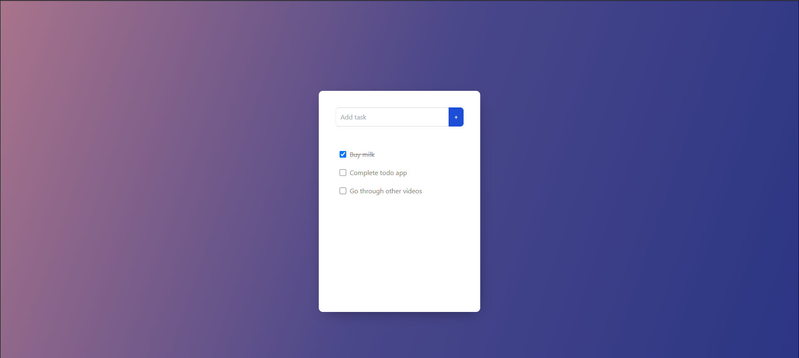

# Project Title

React todo App

## Demo link:

---

Access my site 👉 [here](https://react-todo-app-sourav.netlify.app/)

## Table of Content:

---

- [About The App](#about-the-app)
- [Screenshots](#screenshots)
- [Technologies](#technologies)
- [Setup](#setup)
- [Approach](#approach)
- [Status](#status)
- [Credits](#credits)
- [License](#license)

## About The App

---

React todo App is an app that provides a virtual notepad specifically
for writing down tasks that one needs to complete

## Screenshots

---

## Technologies

---

I mainly used `React` here, along with `HTML`, `CSS` and `JavaScript`.

## Setup

---

- Download or clone the repository
- Run `npm run start` or `npm start`

## Approach

---

I defined a basic structure for the app and then started with the UI first, followed by the functionality. I used Tailwind classes through its CDN for the UI.

## Status

---

The project is complete

## Credits

---

List of contriubutors:

- [Sourav Mehra](https://github.com/mehra-sourav)
- [Flowbite](https://flowbite.com/docs/components/)

## License

MIT license @ [Sourav Mehra](https://github.com/mehra-sourav)
